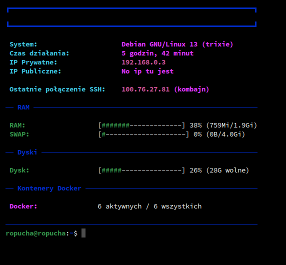

# MOTD zrobione za pomoca prostych skryptow bash
## Wszytkie skrypty były testowane na Debianie 13
#### MOTD pierwszy
Nie potrzebuje żadnej konfiguracji zadziała od strzała (a przynajmniej powinien) 

Zależności potrzebne do odpalenia:
- toilet
##### Przykładowy wygląd

#### MOTD drugi
Domyślnie wyświetla tylko dysk który jest zamontowany w "/" jeżeli chcesz więcej dysków zmodyfikuj tablice w linijce 423 podmieniajac przykładowe punkty montowania na te które cię interesują np. "/mnt/dysk2"

Zależności potrzebne do odpalenia:
- toilet
##### Przykładowy wygląd



## Konfiguracja MOTD

Oba skrypty wspierają plik konfiguracyjny `motd.conf`, który pozwala włączać i wyłączać poszczególne sekcje MOTD.

### Plik motd.conf

Plik konfiguracyjny znajduje się w tym samym katalogu co skrypty MOTD. Możesz włączyć (1) lub wyłączyć (0) poszczególne sekcje:

```bash
# Sekcja nagłówka z nazwą hosta
SHOW_HEADER=1

# Informacje systemowe (system, kernel, czas pracy)
SHOW_SYSTEM_INFO=1

# IP prywatne i publiczne (tylko drugi-motd)
SHOW_IP_INFO=1

# Ostatnie połączenie SSH (tylko drugi-motd)
SHOW_LAST_SSH=1

# Informacje o aktualizacjach (tylko drugi-motd)
SHOW_UPDATES=1

# Sekcja RAM i SWAP
SHOW_MEMORY=1

# Sekcja dysków
SHOW_DISKS=1

# Sekcja kontenerów Docker (tylko drugi-motd)
SHOW_DOCKER=1
```

### Dostępne opcje konfiguracji

| Opcja | Opis | Dostępna w |
|-------|------|------------|
| `SHOW_HEADER` | Nagłówek z nazwą hosta (ASCII art) | Oba skrypty |
| `SHOW_SYSTEM_INFO` | Informacje o systemie, kernelu i czasie pracy | Oba skrypty |
| `SHOW_IP_INFO` | IP prywatne i publiczne | drugi-motd |
| `SHOW_LAST_SSH` | Ostatnie połączenie SSH z IP | drugi-motd |
| `SHOW_UPDATES` | Liczba dostępnych aktualizacji | drugi-motd |
| `SHOW_MEMORY` | Informacje o RAM i SWAP | Oba skrypty |
| `SHOW_DISKS` | Informacje o dyskach | Oba skrypty |
| `SHOW_DOCKER` | Status kontenerów Docker | drugi-motd |


### Jak używać konfiguracji

1. Po instalacji MOTD, plik `motd.conf` będzie skopiowany do `/etc/update-motd.d/`
2. Edytuj plik `/etc/update-motd.d/motd.conf`, aby dostosować wyświetlane sekcje
3. Zmień wartości z `1` na `0`, aby wyłączyć niepotrzebne sekcje
4. Zmiany będą widoczne przy następnym logowaniu

## Instalacja MOTD

```bash
sudo bash install.sh --motd drugi-motd.sh --install-deps
```

Flagi:
- `--motd pierwszy-motd|drugi-motd` – wybór wersji (domyślnie `drugi-motd`)
- `--install-deps` – doinstaluj `toilet`, `lsb-release` (wymaga `apt-get`)

Po instalacji MOTD jest dostępny jako `/etc/update-motd.d/10-motd-custom`.


